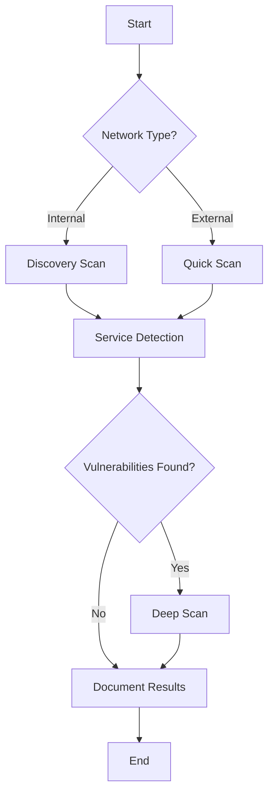

# 🔍 Nmap Scanner Plugin for Dify

<div align="center">


**Professional Network Security Scanner Plugin for Dify Platform**

[Features](#-features) • [Installation](#-installation) • [Tools](#-tools) • [Usage](#-usage) • [Configuration](#-configuration) • [FAQ](#-faq) • [Contributing](#-contributing)

</div>

---

## 📖 Table of Contents

- [Overview](#-overview)
- [Features](#-features)
- [Prerequisites](#-prerequisites)
- [Installation](#-installation)
- [Available Tools](#-available-tools)
- [Usage Examples](#-usage-examples)
- [Configuration](#-configuration)
- [API Reference](#-api-reference)
- [Best Practices](#-best-practices)
- [Troubleshooting](#-troubleshooting)
- [Security Considerations](#-security-considerations)
- [Contributing](#-contributing)
- [License](#-license)
- [Support](#-support)

---

## 🌟 Overview

The **Nmap Scanner Plugin for Dify** brings the full power of Nmap network discovery and security auditing to the Dify platform. This enterprise-grade plugin provides comprehensive network scanning capabilities through an intuitive interface, supporting everything from basic port scans to advanced vulnerability assessments.

### Why This Plugin?

- 🚀 **Full Nmap Power**: Access all Nmap features without command-line complexity
- 🛡️ **Security First**: Built-in safety features and responsible scanning practices
- 🌍 **Multi-language**: Support for 6 languages (English, Bangla, Russian, Chinese, Japanese, Portuguese)
- 📊 **Rich Reporting**: Beautiful formatted outputs with actionable insights
- ⚡ **Performance Optimized**: Intelligent scan optimization for any network size
- 🔧 **Highly Configurable**: From simple scans to advanced penetration testing

---

## ✨ Features

### Core Capabilities

| Feature | Description |
|---------|------------|
| **🔍 Port Scanning** | All scan types: TCP, UDP, SYN, ACK, Window, Maimon, NULL, FIN, Xmas, SCTP |
| **🖥️ Service Detection** | Version detection with adjustable intensity levels |
| **🐧 OS Fingerprinting** | Advanced operating system detection and identification |
| **🌐 Network Discovery** | Multiple discovery methods: ARP, ICMP, TCP, UDP |
| **🛡️ Vulnerability Assessment** | CVE detection, default credentials, security misconfigurations |
| **📊 Comprehensive Scanning** | All-in-one scanner with complete feature set |

### Advanced Features

- **⏱️ Timing Control**: 6 timing templates from paranoid to insane
- **🥷 Evasion Techniques**: Packet fragmentation, decoy hosts, source spoofing
- **🚀 Performance Tuning**: Dynamic parallelism, rate limiting, timeout management
- **📜 NSE Scripts**: Support for 600+ Nmap scripts across all categories
- **📈 Smart Profiles**: Pre-configured scan profiles for common scenarios
- **🔄 IPv6 Support**: Full IPv6 scanning capabilities
- **📝 Multiple Output Formats**: Normal, XML, JSON, Greppable

---

## 📋 Prerequisites

### System Requirements

- **Dify Platform**: Version 0.6.0 or higher
- **Docker**: Container runtime for plugin execution
- **Memory**: Minimum 1GB RAM allocated for plugin
- **Network**: Proper network permissions for scanning

### Software Dependencies

- **Nmap**: Version 7.94 or higher
- **Python**: 3.12 (included in plugin container)
- **python-nmap**: Python wrapper for Nmap

---

## 🚀 Installation

### Step 1: Install Nmap in Plugin Container

First, identify your plugin container:

```bash
# Find the plugin container name
docker ps --format '{{.Names}}' | grep plugin_daemon
```

Install Nmap inside the container:

```bash
# For Ubuntu/Debian based containers
docker exec -it -u root docker-plugin_daemon-1 bash -c \
  'apt-get update && apt-get install -y nmap && nmap --version'

# For Alpine based containers
docker exec -it -u root docker-plugin_daemon-1 ash -c \
  'apk update && apk add nmap nmap-scripts && nmap --version'
```

### Step 2: Install the Plugin

#### Method A: Via Dify UI

1. Navigate to **Tools** → **Plugin Management**
2. Click **"Add Plugin"**
3. Search for **"Nmap Scanner"**
4. Click **Install**
5. Configure credentials if needed

#### Method B: Manual Installation

1. Clone the repository:
```bash
git clone https://github.com/shamspias/dify-nmap.git
cd dify-nmap
```

2. Validate configuration:
```bash
python validate_plugin.py
```

3. Package the plugin:
```bash
dify plugin package .
```

4. Upload the `.difypkg` file via Dify UI

### Step 3: Configure Credentials (Optional)

For privileged operations (SYN scans, OS detection):

```yaml
credentials:
  sudo_password: "your-sudo-password"  # Only if needed
  max_parallelism: 100                  # Default parallel operations
```

---

## 🛠️ Available Tools

### 1. 🎯 **Port Scanner** (`port_scanner`)

Comprehensive port scanning with all Nmap capabilities.

**Features:**
- All scan types (TCP, UDP, SYN, etc.)
- Service and version detection
- OS fingerprinting
- NSE script execution
- Custom timing and performance settings

**Parameters:**
| Parameter | Type | Description | Default |
|-----------|------|-------------|---------|
| `targets` | string | Target specification | Required |
| `ports` | string | Ports to scan | Auto |
| `scan_type` | select | Scan technique | tcp_connect |
| `timing_template` | select | Speed vs stealth | normal |
| `service_detection` | boolean | Detect services | false |
| `os_detection` | boolean | Detect OS | false |

### 2. 🌐 **Network Discovery** (`network_discovery`)

Efficient host enumeration on networks.

**Features:**
- Multiple discovery methods
- MAC address detection
- Vendor identification
- Basic OS identification

**Parameters:**
| Parameter | Type | Description | Default |
|-----------|------|-------------|---------|
| `network` | string | CIDR network | Required |
| `discovery_method` | select | Discovery type | arp |
| `resolve_hostnames` | boolean | DNS resolution | true |
| `scan_speed` | select | Scan speed | normal |

### 3. 🛡️ **Vulnerability Scanner** (`vulnerability_scanner`)

Security-focused vulnerability detection.

**Features:**
- CVE detection
- Default credential checks
- SSL/TLS vulnerability scanning
- Security misconfiguration detection

**Parameters:**
| Parameter | Type | Description | Default |
|-----------|------|-------------|---------|
| `target` | string | Target to scan | Required |
| `scan_level` | select | Scan depth | safe |
| `vulnerability_types` | select | Focus areas | common |
| `check_cves` | boolean | Check CVEs | true |

### 4. 🔧 **Service Detector** (`service_detector`)

Detailed service identification and enumeration.

**Features:**
- Application version detection
- Protocol identification
- Banner grabbing
- Service categorization

**Parameters:**
| Parameter | Type | Description | Default |
|-----------|------|-------------|---------|
| `target` | string | Target host | Required |
| `ports` | string | Port range | 1-1000 |
| `intensity` | number | Detection depth | 7 |

### 5. 🐧 **OS Fingerprinting** (`os_fingerprint`)

Operating system detection and identification.

**Features:**
- TCP/IP stack fingerprinting
- OS version identification
- Device type classification
- Network distance estimation

**Parameters:**
| Parameter | Type | Description | Default |
|-----------|------|-------------|---------|
| `target` | string | Target host | Required |
| `aggressive_guess` | boolean | Aggressive mode | true |
| `scan_limit` | boolean | Limit to promising | true |

### 6. 🚀 **Comprehensive Scanner** (`comprehensive_scanner`)

All-in-one scanner with complete control.

**Features:**
- Pre-configured scan profiles
- Advanced evasion techniques
- Performance auto-optimization
- Complete vulnerability assessment
- Beautiful formatted reports

**Parameters:**
| Parameter | Type | Description | Default |
|-----------|------|-------------|---------|
| `targets` | string | Targets to scan | Required |
| `scan_profile` | select | Scan profile | balanced |
| `performance_level` | select | Performance mode | auto |
| `safe_mode` | boolean | Safety features | true |

---

## 📚 Usage Examples

### Basic Port Scan

```json
{
  "tool": "port_scanner",
  "parameters": {
    "targets": "192.168.1.1",
    "ports": "22,80,443",
    "scan_type": "tcp_connect"
  }
}
```

### Network Discovery

```json
{
  "tool": "network_discovery",
  "parameters": {
    "network": "192.168.1.0/24",
    "discovery_method": "arp",
    "resolve_hostnames": true
  }
}
```

### Vulnerability Assessment

```json
{
  "tool": "vulnerability_scanner",
  "parameters": {
    "target": "example.com",
    "scan_level": "safe",
    "vulnerability_types": "web",
    "check_cves": true,
    "check_ssl_issues": true
  }
}
```

### Comprehensive Security Audit

```json
{
  "tool": "comprehensive_scanner",
  "parameters": {
    "targets": "10.0.0.0/24",
    "scan_profile": "thorough",
    "service_detection": true,
    "os_detection": true,
    "script_categories": "vuln,safe",
    "performance_level": "high"
  }
}
```

### Stealth Scan with Evasion

```json
{
  "tool": "comprehensive_scanner",
  "parameters": {
    "targets": "target.com",
    "scan_profile": "paranoid",
    "fragment_packets": true,
    "decoy_hosts": "192.168.1.5,192.168.1.8,ME",
    "performance_level": "low"
  }
}
```

---

## ⚙️ Configuration

### Scan Profiles

| Profile | Description | Use Case |
|---------|-------------|----------|
| **Quick** | Fast scan of common ports | Initial reconnaissance |
| **Balanced** | Moderate depth and speed | General security assessment |
| **Thorough** | Complete port range with scripts | Comprehensive audit |
| **Paranoid** | Stealth mode with evasion | IDS/IPS environments |
| **Custom** | Full manual control | Advanced users |

### Timing Templates

| Template | T-Value | Delay | Use Case |
|----------|---------|-------|----------|
| **Paranoid** | T0 | 5 min | IDS evasion |
| **Sneaky** | T1 | 15 sec | Stealth required |
| **Polite** | T2 | 0.4 sec | Normal networks |
| **Normal** | T3 | Default | Balanced scanning |
| **Aggressive** | T4 | Fast | Reliable networks |
| **Insane** | T5 | Fastest | Local networks |

### NSE Script Categories

| Category | Description | Risk Level |
|----------|-------------|------------|
| **safe** | Non-intrusive scripts | ✅ Low |
| **discovery** | Additional enumeration | ✅ Low |
| **version** | Enhanced version detection | ✅ Low |
| **vuln** | Vulnerability detection | ⚠️ Medium |
| **auth** | Authentication testing | ⚠️ Medium |
| **intrusive** | Potentially disruptive | ⚠️ High |
| **exploit** | Active exploitation | 🔴 Critical |

---

## 📊 Output Formats

### Text Output
Human-readable formatted output with:
- Structured sections
- Color-coded severity levels
- Summary statistics
- Actionable recommendations

### JSON Output
```json
{
  "scan_info": {
    "command": "nmap -sS -sV ...",
    "version": "7.94",
    "scan_type": ["syn", "version"]
  },
  "statistics": {
    "hosts_up": 10,
    "open_ports": 25,
    "vulnerabilities": 3
  },
  "hosts": [...]
}
```

### XML Output
Complete Nmap XML for further processing with other tools.

---

## 🎯 Best Practices

### Performance Optimization

1. **Network Size Considerations**
   - Small networks (< 50 hosts): Use aggressive timing
   - Medium networks (50-500 hosts): Use normal timing
   - Large networks (> 500 hosts): Use polite timing with chunking

2. **Port Selection**
   - Start with top ports: `--top-ports 100`
   - Expand as needed: `--top-ports 1000`
   - Full scan only when necessary: `-p-`

3. **Parallel Operations**
   - Local networks: 100-300 parallel operations
   - Remote networks: 20-100 parallel operations
   - Sensitive systems: 10-20 parallel operations

### Security Guidelines

1. **Always Get Permission**
   - ✅ Only scan networks you own
   - ✅ Obtain written authorization
   - ✅ Follow responsible disclosure

2. **Use Safe Mode**
   - Enable for production environments
   - Disable only for authorized testing
   - Avoid intrusive scripts on critical systems

3. **Rate Limiting**
   - Respect target resources
   - Use appropriate timing templates
   - Monitor scan impact

### Scan Strategy



---

## 🔧 Troubleshooting

### Common Issues and Solutions

| Issue | Cause | Solution |
|-------|-------|----------|
| **"Nmap not installed"** | Missing Nmap binary | Install Nmap in container (see installation) |
| **"Permission denied"** | Requires root for SYN scan | Use TCP connect scan or provide sudo password |
| **"Host seems down"** | Firewall blocking pings | Use `-Pn` flag or no_ping option |
| **"Scan too slow"** | Conservative timing | Increase timing template or parallelism |
| **"No results"** | Target filtering traffic | Try different scan techniques |

### Debug Mode

Enable verbose logging:

```json
{
  "verbose_level": 5,
  "debugging_level": 2
}
```

### Container Diagnostics

```bash
# Check Nmap installation
docker exec -it docker-plugin_daemon-1 nmap --version

# Test python-nmap
docker exec -it docker-plugin_daemon-1 python -c "import nmap; print('OK')"

# Check available NSE scripts
docker exec -it docker-plugin_daemon-1 ls /usr/share/nmap/scripts/

# View container logs
docker logs docker-plugin_daemon-1 --tail 100
```

---

## 🔒 Security Considerations

### Legal Compliance

> ⚠️ **WARNING**: Network scanning can be illegal without proper authorization.

- **Always** obtain written permission before scanning
- **Never** scan networks you don't own without authorization
- **Comply** with local laws and regulations (CFAA, GDPR, etc.)
- **Respect** privacy and data protection requirements

### Ethical Guidelines

1. **Responsible Use**
   - Use for legitimate security testing only
   - Report vulnerabilities responsibly
   - Protect sensitive information
   - Respect system resources

2. **Data Protection**
   - Scan results may contain sensitive data
   - Store results securely
   - Limit access to authorized personnel
   - Delete data when no longer needed

### Safety Features

- **Rate Limiting**: Prevents overwhelming targets
- **Safe Mode**: Excludes dangerous scripts by default
- **Audit Logging**: Tracks all scanning activities
- **Credential Protection**: Encrypts sensitive data

---

## 🤝 Contributing

We welcome contributions! Please see our [Contributing Guidelines](CONTRIBUTING.md) for details.

### Development Setup

1. Fork the repository
2. Create a feature branch
3. Make your changes
4. Run validation tests
5. Submit a pull request

### Code Style

- Follow PEP 8 for Python code
- Use type hints where applicable
- Add docstrings to all functions
- Write unit tests for new features

### Reporting Issues

- Use GitHub Issues for bug reports
- Include detailed reproduction steps
- Provide system information
- Attach relevant logs

---

## 📄 License

This project is licensed under the MIT License - see the [LICENSE](LICENSE) file for details.

### Third-Party Licenses

- **Nmap**: [Nmap Public Source License](https://nmap.org/book/man-legal.html)
- **python-nmap**: MIT License
- **Dify**: Apache License 2.0

---

## 💬 Support

### Documentation
*Not ready yet – content will be added soon.*
- [Full Documentation](https://github.com/shamspias/dify-nmap/wiki)
- [API Reference](https://github.com/shamspias/dify-nmap/wiki/API)
- [Video Tutorials](https://youtube.com/@shamspias)

### Community
- **GitHub Issues**: [Bug Reports & Features](https://github.com/shamspias/dify-nmap/issues)
- **Email**: info@shamspias.com

### Professional Support
For enterprise support and custom development:
- 📧 Email: info@shamspias.com
- 🌐 Website: [shamspias.com](https://shamspias.com)
- 💼 LinkedIn: [Shamsuddin Ahmed](https://linkedin.com/in/shamspias0)

---

## 🌟 Acknowledgments

- **Nmap Project**: For the incredible network scanning engine
- **Dify Team**: For the amazing AI platform
- **Contributors**: All the wonderful people who have contributed
- **Community**: For feedback and support

---

## 📈 Roadmap

### Version 0.0.2 (Next Release)
- [ ] Web UI for scan visualization
- [ ] Scheduled scanning capabilities
- [ ] Integration with vulnerability databases
- [ ] Custom NSE script support
- [ ] Scan result comparison

### Version 0.0.3 (Future)
- [ ] Machine learning for anomaly detection
- [ ] Automated vulnerability remediation
- [ ] Cloud target support (AWS, Azure, GCP)
- [ ] Compliance scanning (PCI-DSS, HIPAA)
- [ ] API endpoint scanning

---

<div align="center">

**Made️ by [Shamsuddin Ahmed](https://github.com/shamspias)**

[](https://github.com/shamspias/dify-nmap)
[](https://github.com/shamspias)
[](https://twitter.com/intent/tweet?text=Check%20out%20this%20awesome%20Nmap%20Scanner%20Plugin%20for%20Dify!&url=https://github.com/shamspias/dify-nmap)

</div>